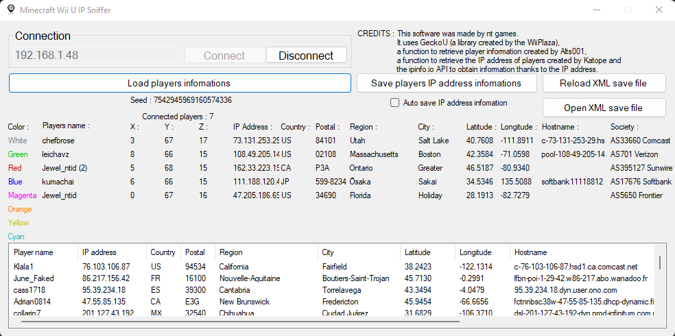

# What is this ?
This is the code of Minecraft Wii U IP Sniffer, a software, a RTM tool for sniff players IP in Minecraft Wii U and have other informations.    
As this software is very powerful (with an IP you can do a lot of things and I'm afraid it will destroy the Minecraft Wii U community), I had put a password for the code of the main form and for the software.    
I deleted the password on 01/09/2022 following the arrival of Trinity V3 which also contained an IP Grabber/Sniffer.    
I hope you will understand my choice...    
If you want to know, the password was "Minecraft Wii U IP Sniffer" converted to hexadecimal and then to IP address.    
Here is the final password : 77.105.110.101.99.114.97.102.116.32.87.105.105.32.85.32.73.80.32.83.110.105.102.101.114
This is a beta so it contains many bugs, names sometimes have placement problems but IP addresses are normally well placed.    
Here is a picture to show what the software looks like and to show its power (I removed my IP address from the image but I left the other players IP addresses, I'm sorry I put their ip address here but I needed an example) :    
A example of the software in a random Tumble game"></img>

# How do I compile ? 
You can compile this with [Microsoft Visual Studio](https://visualstudio.microsoft.com/) or with other development software in C#.

# Credits
**nt games** for making the software.    
**Wii Plaza** for making [GeckoU](https://github.com/XxModZxXWiiPlaza/GeckoU).    
**Alts001** for making the players informations (name and coordinates) code.   
**Katope** for making the IP address sniffer code.     
